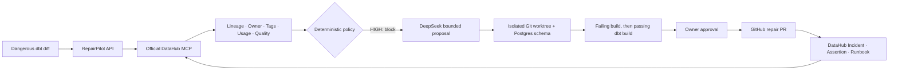

# RepairPilot

> **Block. Repair. Prove. Remember.**

[](https://github.com/TianChen17/repairpilot/actions/workflows/ci.yml)
[](LICENSE)

RepairPilot is an incident-to-repair autopilot for dangerous data changes. It
uses DataHub's context graph and official MCP server to discover the real blast
radius of a dbt schema change, applies deterministic release policy, generates a
bounded compatibility repair, proves it with a real dbt build, requests owner
approval, publishes a reviewable GitHub PR, and writes reusable evidence back to
DataHub.

Built for **Build with DataHub: The Agent Hackathon** in the **Agents That Do
Real Work** challenge.

## Try the hosted project

- **RepairPilot:** <https://repairpilot.145-241-207-154.sslip.io>
- **DataHub catalog:** <https://catalog.145-241-207-154.sslip.io>
- **Validated repair PR:** <https://github.com/TianChen17/repairpilot/pull/1>
- **Sample outputs:** [`examples/`](examples/)
- **90-second test path:** [`docs/JUDGE_GUIDE.md`](docs/JUDGE_GUIDE.md)
- **Video source and publishing package:** [`video/`](video/) · [`docs/YOUTUBE_AND_DEVPOST.md`](docs/YOUTUBE_AND_DEVPOST.md)

DataHub read-only demo login:

```text
username: judge@repairpilot.demo
password: RepairPilot-Judge-2026!
role: Reader
```

These are intentionally public, non-sensitive testing credentials. The catalog
contains only synthetic demonstration metadata.

## The incident

Northstar Commerce proposes a dbt rename:

```diff
- gross_amount
+ gross_amount as gross_revenue
```

Before merge, RepairPilot asks DataHub MCP for the field schema, column lineage,
ownership, Domain, governance tags, quality health, downstream dashboard, and
stored query usage. The deterministic policy finds a Tier-1 governed financial
metric with four downstream consumers and returns `HIGH / 100 / BLOCK`.

DeepSeek V4 Flash can then propose only three allowlisted operations:

1. expose `gross_revenue` while retaining `gross_amount` as a temporary alias;
2. migrate the controlled downstream model;
3. add a real dbt schema test.

RepairPilot reproduces the original failure, applies the bounded repair inside
an isolated Git worktree and temporary Postgres schema, runs
`dbt build --select stg_orders+`, and waits for the Revenue Analytics owner. Only
after approval does it publish the reviewable result and write an Incident
Document, Assertion, verification tag, and Runbook back to DataHub.

## Architecture



| Layer | Implementation | Authority |
|---|---|---|
| Context | DataHub OSS + official MCP server | Source of lineage and governance truth |
| Risk | Versioned Python policy | Sole release decision maker |
| Reasoning | `deepseek-v4-flash` JSON contract | Proposes repair intent only |
| Execution | Fixed dbt templates and allowlisted paths | Applies bounded edits in isolation |
| Proof | dbt Core + Postgres + Git SHA-256 | Must pass before approval appears |
| Authority | Human owner approval | Required for every high-risk repair |
| Memory | DataHub MCP mutations + Metadata API | Persists Incident, Assertion, tag, Runbook |

## What is real and what is synthetic

The 1,200 Northstar Commerce order rows, company name, owners, dashboard, and
stored usage queries are synthetic and generated with a fixed seed. No personal
or production data is present.

The following are live, executable integrations—not mocked screenshots:

- PostgreSQL relations and 1,200 rows;
- dbt models, lineage, artifacts, failure, 14 selected tests, and repair build;
- DataHub entities, column lineage, MCP reads, Documents, tag, and Assertion;
- DeepSeek V4 Flash API proposal;
- isolated Git commits, patch hash, owner decision, and GitHub PR;
- immutable Evidence Receipt returned by the hosted API.

The dashboard and queries are clearly labeled `SyntheticDemo` metadata. This
project does not claim to run Looker, Airflow, Slack, or PagerDuty.

## Safety properties

- The LLM cannot set risk, approve a change, publish a repair, choose arbitrary
  paths, or execute shell/SQL.
- Missing DataHub context, failed dbt validation, rejected approval, concurrent
  judge runs, and unexpected errors all fail closed.
- Generated operations must exactly match three safe operation types and three
  allowlisted dbt files; prompt-injection and destructive-language contracts are
  rejected.
- Validation uses a detached Git worktree and a per-run `rp_*` Postgres schema.
- The MCP and dbt subprocesses receive minimal allowlisted environments and do
  not inherit the DeepSeek credential path or unrelated server secrets.
- DataHub GMS, Postgres, Kafka, MySQL, and OpenSearch bind only to loopback.
- The hosted backend loads DeepSeek from a systemd encrypted credential and
  never exposes it to the browser, repository, artifacts, or logs.
- Public writes are limited to one synthetic scenario, rate-limited, and guarded
  by a global run lock.

See [`docs/SECURITY.md`](docs/SECURITY.md) for the threat model.

## Reproduce locally

Tested on Ubuntu 24.04 ARM64/aarch64 with Docker 29, Compose 2.40, Python 3.12,
Node 22, DataHub OSS 1.6.0, dbt 1.10, and MCP Server DataHub 0.6.0. Allow at
least 8 GB RAM and 20 GB of free disk for DataHub Quickstart images and volumes.

### 1. Install the application and Postgres

```bash
git clone https://github.com/TianChen17/repairpilot.git
cd repairpilot
./scripts/bootstrap.sh
```

### 2. Start and harden DataHub Quickstart

```bash
.venv/bin/datahub docker quickstart --version v1.6.0 --arch arm64
.venv/bin/python scripts/harden_datahub_ports.py
docker compose --env-file "$HOME/.datahub/quickstart/.local-secrets.env" \
  --profile quickstart \
  -f "$HOME/.datahub/quickstart/docker-compose.yml" \
  -p datahub up -d --wait
```

For x86_64, replace `--arch arm64` with `--arch x86`.

### 3. Build dbt and ingest DataHub

```bash
./scripts/ingest_datahub.sh
```

This performs a real baseline build, preserves `run_results_build.json`, creates
dbt docs artifacts, ingests Postgres and dbt metadata, and seeds the synthetic
Owner, Domain, Tags, Dashboard, three Query entities, and descriptions.

### 4. Run RepairPilot

Export your own DeepSeek API key in the shell; never add it to a repository file.

```bash
set -a
source .env.example
set +a
read -rsp 'DeepSeek API key: ' DEEPSEEK_API_KEY
export DEEPSEEK_API_KEY
.venv/bin/uvicorn app.main:app --app-dir backend --host 127.0.0.1 --port 8766
```

In a second terminal:

```bash
npm --prefix frontend run dev -- --host 127.0.0.1
```

`REPLAY` remains visibly labeled and works without a model key. It reuses a
captured context/proposal fixture but still runs the executable dbt validation.

## Quality gates

```bash
./scripts/quality-gates.sh
REPAIRPILOT_E2E_RUNS=3 ./scripts/live-e2e.sh
```

The local gate enforces architecture and secret preflight, Ruff, formatting,
26 Python tests with at least 75% coverage, a real dbt integration test, dbt
parse, frontend production build, and both public HTTPS health checks. The Live
gate requires three consecutive complete runs under 150 seconds each with stable
Patch SHA, unique Incident URNs, one idempotent Runbook URN, zero residual
worktrees, and verifiable Evidence Receipts.

Current results and evidence are in [`docs/QUALITY_REPORT.md`](docs/QUALITY_REPORT.md).

The competition video is a reproducible 175-second Remotion composition with
50 shots, English AI narration, open captions, real UI captures, and an
objective codec/loudness/black-frame validator. See [`video-spec.md`](video-spec.md).

## Public API

```text
POST /api/v1/demo/reset
POST /api/v1/incidents
GET  /api/v1/incidents/{run_id}
GET  /api/v1/incidents/{run_id}/events
POST /api/v1/incidents/{run_id}/approval
GET  /api/v1/incidents/{run_id}/artifacts/{name}
```

Allowed downloadable artifacts are the patch, Evidence Receipt, dbt run
results, and command results. Artifact names are an explicit allowlist; traversal
and arbitrary file access return 404.

## Project provenance

RepairPilot was newly created during the July 6–August 10, 2026 submission
period. No pre-existing proprietary application code is incorporated. It uses
the open-source dependencies declared in `pyproject.toml`, `package.json`, and
the DataHub Quickstart images, and was developed with AI coding assistance.

## License

[Apache License 2.0](LICENSE).
