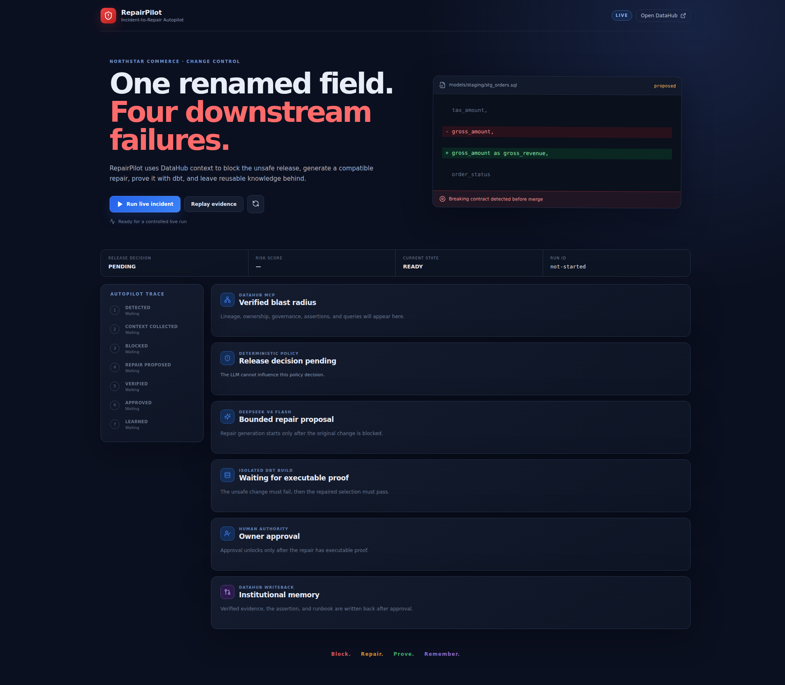
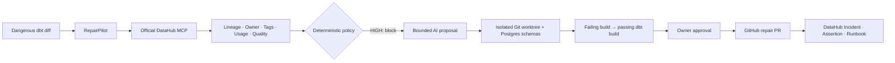

# RepairPilot

> **Block. Repair. Prove. Remember.**

[](https://github.com/TianChen17/repairpilot/actions/workflows/ci.yml)
[](LICENSE)

RepairPilot is an incident-to-repair autopilot for dangerous data changes. It
uses DataHub's context graph and official MCP server to find the real blast
radius, blocks unsafe releases with deterministic policy, generates a bounded
dbt repair, proves it by execution, requests the accountable owner's approval,
and writes reusable incident knowledge back to DataHub.

Built for **Build with DataHub: The Agent Hackathon** in **Agents That Do Real
Work**.



## Judge in 60–90 seconds

1. Open the [hosted RepairPilot](https://repairpilot.145-241-207-154.sslip.io)
   and click **Run live incident**. Watch DataHub context produce a deterministic
   `HIGH · 100/100 · BLOCK` decision.
2. At **AWAITING APPROVAL**, inspect the failed original build, passing repair
   build, 14 tests, commits, and Patch SHA; then click **Approve repair**.
3. Inspect the public [four-file draft PR](https://github.com/TianChen17/repairpilot/pull/1)
   and the DataHub Incident, Assertion, verified tag, and Runbook.

The page shows the current phase and remaining time. Only one live run executes
at once; a clearly labeled Replay is available if another judge is testing.
Detailed access notes are in the [Judge Guide](docs/JUDGE_GUIDE.md).

Read-only DataHub access:

```text
URL:      https://catalog.145-241-207-154.sslip.io
username: judge@repairpilot.demo
password: RepairPilot-Judge-2026!
role:     Reader
```

On first login, dismiss the Welcome Tour and the “Narrow your search” tip, then
open `stg_orders`. These credentials are intentionally public and non-sensitive;
the catalog contains synthetic demonstration metadata only.

## The evidence loop

| Stage | What actually happens | Reviewable evidence |
|---|---|---|
| **Read** | Official DataHub MCP retrieves schema, field lineage, Owner, Domain, Tags, quality status, stored queries, and dashboard impact | MCP tool trace and DataHub UI |
| **Block** | Versioned Python policy scores the rename `HIGH · 100/100` | Matched rules and fail-closed decision |
| **Repair** | DeepSeek V4 Flash proposes only three allowlisted dbt operations | Structured proposal and four-file Git patch |
| **Prove** | Detached worktree and per-run Postgres schemas reproduce failure, then run `dbt build --select stg_orders+` | 14 passing tests, invocation ID, commits, Patch SHA |
| **Approve** | Revenue Analytics approval unlocks publication; rejection creates no PR | Timestamped approval record and public draft PR |
| **Remember** | DataHub receives a per-run Incident, Assertion, verified tag, and idempotent Runbook | Native DataHub entities and immutable Evidence Receipt |

The demonstrated change renames `gross_amount` to `gross_revenue`. DataHub shows
three downstream dbt models and the `Executive Revenue Pulse` dashboard at risk.
RepairPilot retains the old alias temporarily, migrates the controlled consumer,
adds a schema test, and generates a migration note.

## What RepairPilot adds to DataHub

DataHub supplies governed context and organizational memory. RepairPilot turns
that context into a controlled action loop:

- a deterministic release decision the LLM cannot override;
- a constrained repair contract instead of arbitrary code or shell access;
- isolated, executable dbt failure and repair proof;
- proof-gated human approval and reviewable GitHub output;
- a cryptographic Evidence Receipt joining DataHub URNs, policy, Git, dbt,
  approval, PR, and write-back addresses;
- new knowledge written to the catalog for the next responder.

This is not a chat interface that only explains an incident: it changes code,
runs the affected graph, enforces authority, and preserves the verified result.

## Real execution, synthetic business data

The Northstar Commerce name, 1,200 fixed-seed order rows, Owner, dashboard, and
stored queries are synthetic. No personal or production data is present. The
dashboard and query entities are labeled `SyntheticDemo`; the project does not
claim to operate Looker, Airflow, Slack, or PagerDuty.

These integrations execute live:

- PostgreSQL relations and dbt models, artifacts, failure, repair, and tests;
- DataHub OSS entities, graph, official MCP reads/mutations, Documents, Tags,
  and Assertions;
- DeepSeek V4 Flash structured repair proposal;
- isolated Git commits, patch hash, owner decision, and GitHub PR;
- immutable Evidence Receipt returned by the hosted API.

## Architecture and authority



| Layer | Implementation | Authority |
|---|---|---|
| Context | DataHub OSS + official MCP | Source of lineage and governance truth |
| Risk | Versioned Python rules | Sole release decision maker |
| Reasoning | `deepseek-v4-flash` JSON contract | Proposes repair intent only |
| Execution | Fixed templates and path allowlists | Applies bounded edits in isolation |
| Proof | dbt Core + Postgres + Git SHA-256 | Must pass before approval appears |
| Authority | Human owner approval | Mandatory for high-risk repair |
| Memory | DataHub MCP mutations + Metadata API | Persists Incident, Assertion, tag, Runbook |

Missing DataHub context, failed dbt validation, rejected approval, unexpected
model output, and concurrent runs all fail closed. Generated shell, arbitrary
SQL, path traversal, and targets outside the three allowed dbt files are
rejected. See the [security model](docs/SECURITY.md).

## Run locally

Tested on Ubuntu 24.04 ARM64/aarch64 with Docker 29, Compose 2.40, Python 3.12,
Node 22, DataHub OSS 1.6.0, dbt 1.10, and MCP Server DataHub 0.6.0. Allow at
least 8 GB RAM and 20 GB free disk.

```bash
git clone https://github.com/TianChen17/repairpilot.git
cd repairpilot
./scripts/bootstrap.sh

.venv/bin/datahub docker quickstart --version v1.6.0 --arch arm64
.venv/bin/python scripts/harden_datahub_ports.py
docker compose --env-file "$HOME/.datahub/quickstart/.local-secrets.env" \
  --profile quickstart \
  -f "$HOME/.datahub/quickstart/docker-compose.yml" \
  -p datahub up -d --wait

./scripts/ingest_datahub.sh
```

For x86_64, replace `--arch arm64` with `--arch x86`. To start the application,
provide your own DeepSeek key in the current shell—never commit it:

```bash
set -a
source .env.example
set +a
read -rsp 'DeepSeek API key: ' DEEPSEEK_API_KEY
export DEEPSEEK_API_KEY
.venv/bin/uvicorn app.main:app --app-dir backend --host 127.0.0.1 --port 8766
```

In another terminal:

```bash
npm --prefix frontend run dev -- --host 127.0.0.1
```

`REPLAY` stays visibly labeled. It reuses captured MCP/model evidence but still
runs the real isolated dbt validation.

## Verify and inspect

```bash
./scripts/quality-gates.sh
REPAIRPILOT_E2E_RUNS=3 ./scripts/live-e2e.sh
```

The gates cover architecture, secret hygiene, policy and prompt-injection tests,
Python coverage, dbt integration, frontend build, public health, stable patch
hash, unique Incident URNs, an idempotent Runbook, and zero residual schemas or
worktrees. See the timestamped [Quality Report](docs/QUALITY_REPORT.md).

Reviewable artifacts are in [`examples/`](examples/): repair patch, dbt results,
command output, migration note, Incident, Runbook, Evidence Receipt, and
three-run summaries.

## Public API

```text
POST /api/v1/demo/reset
POST /api/v1/incidents
GET  /api/v1/incidents/{run_id}
GET  /api/v1/incidents/{run_id}/events
POST /api/v1/incidents/{run_id}/approval
GET  /api/v1/incidents/{run_id}/artifacts/{name}
```

Artifact names use an explicit allowlist; traversal and arbitrary file access
return 404.

## Provenance and license

RepairPilot was created during the July 6–August 10, 2026 submission period.
No pre-existing proprietary application code is incorporated. Open-source
dependencies are declared in the Python, frontend, and video manifests; AI
coding assistance was used during development.

Licensed under the [Apache License 2.0](LICENSE).
